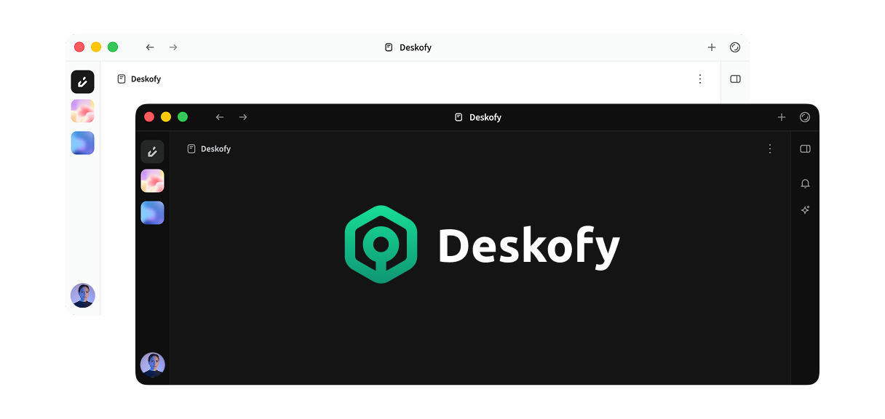
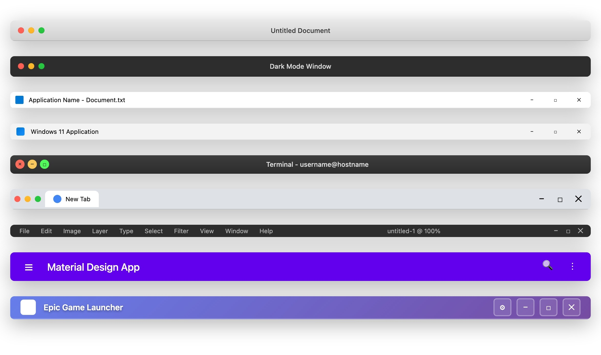
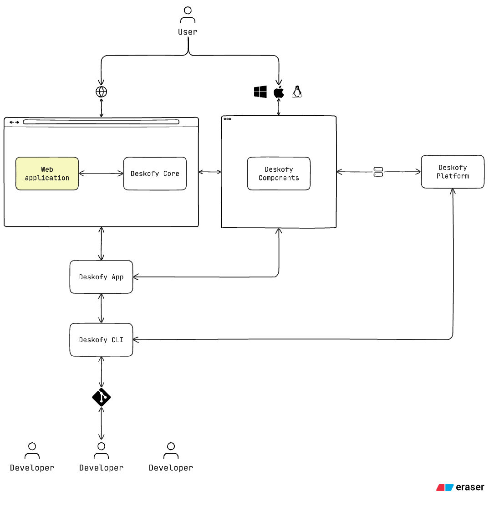

<p align="center">
  <picture>
    
  </picture>
</p>

<p align="center">Deskofy (TS) - Public Preview</p>

<p align="center"><b>Your Web App, Now a Full-Fledged Desktop Experience.</b></p>

<p align="center">
    <a href="https://deskofy.app" target="_blank">Platform</a>
    &nbsp;•&nbsp;
    <a href="https://docs.deskofy.app" target="_blank">Docs</a>
    &nbsp;•&nbsp;
    <a href="https://linkedin.com/company/deskofy" target="_blank">LinkedIn</a>
    &nbsp;•&nbsp;
    <a href="https://x.com/DeskofyHQ" target="_blank">X</a>
</p>

> [!NOTE]
>
> If you’re a **founder, indie developer, or startup** building web-based products, we’re working on **Deskofy Platform**, an infrastructure platform designed to simplify cross-platform development and deployment of native desktop apps using Electron.
>
> **Deskofy Platform** handles everything from version control to cross-platform builds and deployments, so you can focus on building your product, not managing complex setup.
>
> Join our waitlist at [deskofy.app](https://deskofy.app?utm_source=deskofy-repository)

<h2>Table of Contents</h2>

- [Overview](#overview)
- [Why Deskofy](#why-deskofy)
- [Quick Start](#quick-start)
- [Plugins Support](#plugins-support)
- [Component Support](#component-support)
- [Repository Structure](#repository-structure)
- [Deskofy Architecture](#deskofy-architecture)
- [Documentation](#documentation)
- [Contributing](#contributing)
- [Security](#security)
- [Code of Conduct](#code-of-conduct)
- [License](#license)

## Overview

**Deskofy TS (Deskofy TypeScript)** is a **cross-platform framework** built on top of **Electron** to help developers build and distribute **production-ready native desktop applications** with **minimal engineering effort**.

The entire Deskofy application can be managed through a single `JSON5`-based configuration file. For different environments, you can maintain separate files such as `production.config.json5`, `development.config.json5`, and more. With just one configuration file, you can set up and run a fully production-ready application.

If you need more advanced capabilities, you can easily extend the setup with custom plugins. Plus, you don’t have to worry about handling complex build processes, Deskofy takes care of it for you, making the entire workflow simple and efficient.

## Why Deskofy

In the AI era, thousands of applications are being built by developers and creators using powerful AI tools. However, most of these focus solely on web applications.

The truth is, users love the convenience of desktop applications. Turning a web app into a desktop experience makes access faster and the overall experience smoother. Desktop apps are easy to use, reliable, and provide a more seamless workflow.

Big companies invest in building desktop applications because they can handle the development and infrastructure costs. At Deskofy, our mission is to make that same power accessible to indie developers, founders, and early-stage startups, without the heavy costs or complexity.

We enable you to give your users a true desktop experience effortlessly.

## Quick Start

Creating a native app in Deskofy is incredibly simple, you can get one up and running in about the same time it takes to make a bowl of noodles.

**Step 01**: Install Deskofy CLI globally

```bash
npm install -g @deskofy/cli
```

**Step 02**: Create a new Deskofy project

```bash
deskofy create # or `npx deskofy create`
```

**Step 03**: Run your Deskofy project

```bash
deskofy run # or `npx deskofy run`
```

_🎉 Boom! Your first Deskofy application has been created successfully!_

## Plugins Support

You can easily write Electron-based plugins and import them directly through the configuration file. Here are a few examples:

**Main Plugin Sample**:

```ts
// Initialize a new Electron window

import { BrowserWindow, App } from 'electron';

const plugin = {
  init: (deskofyApp: App) => {
    deskofyApp.whenReady().then(() => {
      const mainWindow = new BrowserWindow({
        width: 800,
        height: 600,
        webPreferences: {
          nodeIntegration: true,
          contextIsolation: false,
        },
        show: true,
      });

      mainWindow.loadURL(
        'data:text/html;charset=utf-8,' +
          encodeURIComponent(
            '<h1>Hello from Main Plugin!</h1><p>This window was created by your plugin.</p>',
          ),
      );

      mainWindow.webContents.openDevTools();

      console.log('Window created and visible.');
    });

    deskofyApp.on('window-all-closed', () => {
      if (process.platform !== 'darwin') {
        deskofyApp.quit();
      }
    });
  },
};

export default plugin;
```

**Renderer Plugin Sample**:

```ts
// Console log with Electron

import type { IpcRenderer } from 'electron';

const plugin = {
  init: (deskofyIpcRenderer: IpcRenderer) => {
    console.log('This will print in the console');
  },
};

export default plugin;
```

## Component Support

We provide reusable React components, like a customizable Title Bar, that let you build any kind of title bar to match your web application’s style and aesthetics. You can easily integrate it directly into your app and make it look and feel native.

**Example**:

```tsx
const Layout = ({ children }) => (
  <>
    <TitleBar
    // Custom configurations...
    />

    {children}
  </>
);

export default Layout;
```

<p align="center">
  <picture>
    <source width="700px" media="(prefers-color-scheme: dark)" srcset="./.readme/title-bar-dark.jpeg">
    <source width="700px" media="(prefers-color-scheme: light)" srcset="./.readme/title-bar-light.jpeg">
    
  </picture>
</p>

## Repository Structure

This monorepo **`deskofy/deskofy`** contains the following main packages:

| Name                         | Package          | Description                                                                                    |
| ---------------------------- | ---------------- | ---------------------------------------------------------------------------------------------- |
| **Deskofy Framework**        | `@deskofy/app`   | The core runtime framework built on Electron                                                   |
| **Deskofy CLI Utility**      | `@deskofy/cli`   | Command-line tool to create, build, and deploy Deskofy apps                                    |
| **Deskofy Core**             | `@deskofy/core`  | TypeScript library to interact with native features of desktop application on website frontend |
| **Deskofy React Components** | `@deskofy/react` | Prebuilt React-based UI components                                                             |

Deskofy is developed and maintained by the [Orbivon](https://orbivon.com?utm_source=deskofy-repository) team.
The ecosystem includes:

- **Open-Source Framework (this repository)**: freely available and extensible.
- **Managed Infrastructure (closed-source)**: will be available at [deskofy.app](https://deskofy.app?utm_source=deskofy-repository), providing build orchestration, cloud deployments, and analytics.

## Deskofy Architecture

<p align="center">
  <picture>
    <source width="700px" media="(prefers-color-scheme: dark)" srcset="./.readme/architecture-diagram-dark.png">
    <source width="700px" media="(prefers-color-scheme: light)" srcset="./.readme/architecture-diagram-light.png">
    
  </picture>
</p>

## Documentation

To read the documentation, please visit [docs.deskofy.app](https://docs.deskofy.app).

## Contributing

We welcome contributions! To get started:

1. Fork the repository
2. Create a new branch (`feat/my-feature` or `fix/my-bug`)
3. Follow our [commit conventions](./CONTRIBUTING.md)
4. Submit a pull request

For detailed guidelines, see [CONTRIBUTING.md](./CONTRIBUTING.md).

## Security

If you discover a security issue, please **do not** open a public issue.
Instead, report it privately via **[security@deskofy.app](mailto:security@deskofy.app)**.
We’ll acknowledge and fix validated vulnerabilities promptly.

## Code of Conduct

We are committed to fostering an open and welcoming environment.
Please read our [Code of Conduct](./CODE_OF_CONDUCT.md) before contributing.

## License

Deskofy (TS) is distributed under the **MIT open-source license**,
which you can find in the [LICENSE](https://github.com/deskofy/deskofy?tab=License-1-ov-file) file.

<br />

<p align="center">⭐ If you find this project useful, please give it a star!</p>

<p align="center">📢 Share it with your friends to help others discover it too.</p>

<p align="center">⏱️ Don't forget to join the <a href="https://deskofy.app?utm_source=deskofy-repository">waiting list</a>.</p>

---

<small>
  <p align="center">Made with ❤️ by the <a href="https://orbivon.com?utm_source=deskofy-repository">Orbivon</a> Team</p>
</small>
